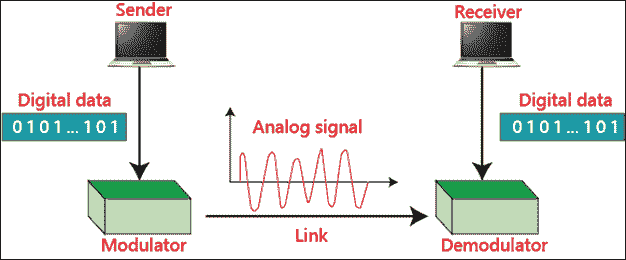
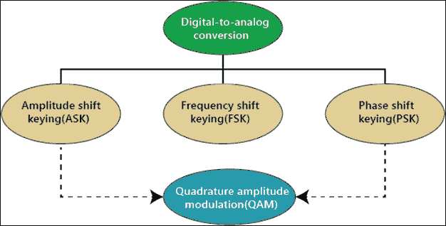
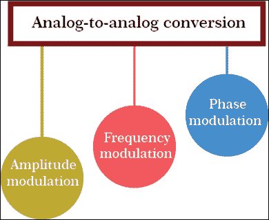
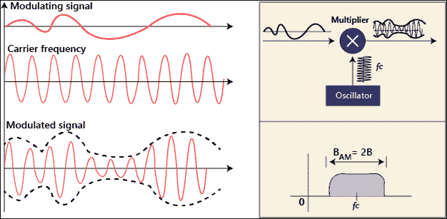
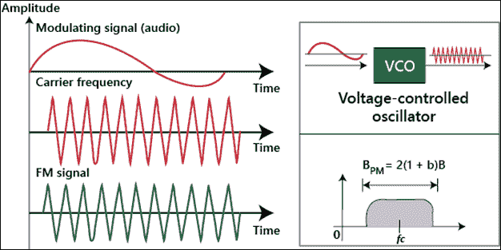
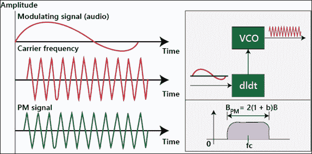

# 模拟传输

> 原文：<https://www.tutorialandexample.com/analog-transmission/>

### 数模传输

数据通过模拟载波从一个设备发送到另一个设备，并首先转换成模拟信号。它修改模拟信号来表示数字数据。该图显示了数模调制过程与最终模拟信号之间的关系。

模拟传输定义了三种基本方法:

1.  振幅移位键控
2.  频移键控
3.  PSK(相移键控)

第四种模拟传输是幅移键控和相移键控的组合，称为正交幅度调制(QAM)。

**幅移键控(ASK)**

ASK 是一种调制类型，它将载波幅度作为变量反映到数字数据中。即使幅度变化，频率和相位也保持不变。

### 频移键控

FSK 是一种调制类型，它将载波频率作为变量反映到数字数据中。对于调制信号，信号元素的持续时间是恒定的，但是当一个信号元素改变时，下一个信号元素改变。对于所有的信号元素都保持恒定的幅度和相位。

### 相移键控(PSK)

PSK 是一种调制类型，它将载波的相位作为变量反映到数字数据中。即使相位发生变化，振幅和频率也保持不变。今天，PSK 比 ASK 或 FSK 更受欢迎。

### 正交调幅(QAM)

ASK 和 PSK 的组合称为正交幅度调制。QAM 有多种可能的变体。

### 模拟到模拟传输

它是模拟信号对模拟数据的表示。如果只有一个带通信道可供我们使用，就需要调制。模拟到模拟传输的最好例子是无线电系统。每个信号产生模拟信号。

有三种方法可以实现模数转换:

1.  调幅
2.  频率调制
3.  相位调制

### 调幅

调幅是一种将高频载波信号转换为调制信号振幅的调制方式。载波信号的频率和相位相同，但幅度会改变数据。载波的包络是调制信号。

总的 AM 带宽可以用音频信号的带宽来定义: ***B AM = 2B* 。**

### 频率调制

在这种传输中，载波信号的频率被调制以改变调制信号的电压电平。载波的最高振幅和相位是恒定的，但是当信息信号的振幅改变时，载波的频率也随之改变。

总的 FM 带宽可以用音频信号的带宽来定义: ***B FM = 2(1 *？)b .*T5】**

### 相位调制

在这种传输中，载波信号的相位被调制以改变调制信号的电压电平。载波的最高振幅和频率是恒定的，但是当信息信号的振幅改变时，载波的相位也随之改变。

总的 FM 带宽可以用音频信号的带宽来定义: ***B PM = 2(1 +？)b .*T5】**

