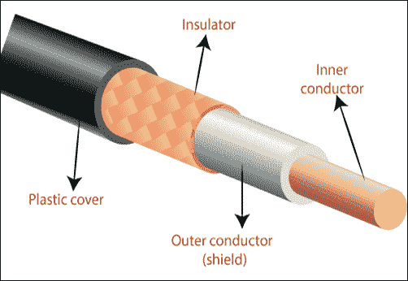

# 传输媒体

> 原文：<https://www.tutorialandexample.com/transmission-media/>

**传输媒体**:物理层直接控制传输媒体。传输介质是一种将数据从一个地方传输到另一个地方的方式。它将数据从源传送到目的地。例如，空气是两个民族之间互动的传播媒介。对于书面信息，传输媒介可能是邮递员或飞机。传输介质也称为通信信道。传输介质如下图所示。

在这种情况下，人们通常使用不同类型的电线和电波来传输数据。数据通常通过电磁能量从一个系统传输到另一个系统。

通常，传输介质可以分为两种类型:

**1。引导媒体**

**2。无导向介质**

## 引导媒体

导向媒体是有线媒体。导向媒体是一种将数据从一个地方传输到另一个地方的物理方式。引导式媒体更安全。这些类型的网络使用电缆进行通信。

导向媒体分为三种类型的电缆:

**1。双绞线**

**2。同轴电缆**

**3。光纤电缆。**

## 双绞线电缆

双绞线电缆是一种铜质电缆，以螺旋方式排列，以最大限度地减少相邻线对之间的电磁干扰。它主要是为声音传输而发明的。双绞线电缆比其他电缆便宜得多。双绞线电缆如下图所示。

计算机网络中使用两种类型的双绞线电缆。

**1。屏蔽双绞线**

**2。非屏蔽双绞线**

**屏蔽双绞线**

每根电缆的屏蔽双绞线都用金属箔包裹，以防止电磁干扰。它提供了更多的安全性和传输速度，因为这种屏蔽减少了数据的电磁场。

**非屏蔽双绞线**

非屏蔽双绞线的电缆没有用金属箔包裹。这根电缆用一层塑料布包裹着。它提供的安全性和传输速度低于屏蔽双绞线。

在这种电缆中，数据传输速度可以从 1 GB 到 10 GBPS。这种电缆通常可以传输 100 到 150 米范围内的数据。

**双绞线的优点**

1.这条电缆比其他电缆便宜。

2.这种电缆安装非常容易。它可以很容易地与插头连接，如 RJ 45(注册插孔类型 45)。

3.此电缆提供了与其他电缆的简单连接。

**双绞线电缆的缺点**

1.如果电缆的距离大于 100 米，双绞线电缆的高速率误差会增加。

2.这是一根非常细的电缆，所以很容易被折断。

3.这种电缆带宽低，因此不适合宽带连接。

## 同轴电缆

同轴电缆是由四层构成的铜电缆。电缆的最内层由铜制成。固体塑料覆盖在铜缆的上层。它的上层有金属箔和铜网，称为导体。在上层，它有一个塑料盖来保护它们。同轴电缆数据传输速度为 5 Mbps。同轴电缆多用于有线[电视](https://www.tutorialandexample.com/who-invented-television)和录像机。

同轴电缆与 BNC 连接器一起使用，BNC 连接器有多种类型，例如 T 型连接器、筒式连接器和终端连接器。如下面的同轴电缆所示。

在[计算机网络](https://www.tutorialandexample.com/computer-network-tutorial)中使用两种类型的同轴电缆。

**1。细网同轴电缆**

**2。粗网同轴电缆**

**细网同轴电缆**

细网同轴电缆是一种细电缆。细网同轴电缆被称为细以太网。这根电缆的直径是 0.25 英寸。在没有中继器的情况下，它只能覆盖 185 米。

**粗网同轴电缆**

粗网同轴电缆比细网电缆粗。粗网同轴电缆被称为粗以太网。这根电缆的直径是 0.5 英寸。没有中继器只能覆盖 500 米。它也叫 10Base5。

**同轴电缆的优势**

1.  与双绞线电缆相比，它提供了更好的带宽。
2.  安装起来很简单。
3.  与双绞线电缆相比，它提供了更高的数据传输速度。

**同轴电缆的缺点**

1.  与双绞线电缆相比，维护成本非常昂贵。
2.  如果电缆在任何地方断裂，整个网络都会瘫痪。
3.  它比双绞线电缆更贵。

## 光纤电缆

光缆是由玻璃或塑料制成的。它以光的形式传递信号。它比所有其他电缆都贵，而且它的数据传输速度也比所有其他电缆都高。下图显示了光纤电缆。

在这种电缆中，数据传输是以光的形式而不是电流的形式进行的，因此这种电缆提供了更高的数据传输速度。光缆数据传输速度范围从 100 Mbps 到 10 Gbps。

该电缆中使用了各种类型的连接器，如 SC 连接器、ST 连接器、MT-RJ 连接器等。

**光缆的优势**

1.  与所有其他电缆相比，它提供了非常高的数据传输速度。
2.  光缆比双绞线和同轴电缆轻。
3.  这种电缆不易着火，因为它不导电。

**光缆的缺点**

1.  与其他短距离电缆相比，这种电缆成本较高。
2.  这种电缆安装和维护起来很复杂，因为它并不是到处都有。

## **非导向介质**

非导向介质对电磁波起作用。它不使用任何物理导体。它也被称为无线媒体。无制导信号可以通过三种方式传播，如地面传播、空中传播和视线传播。

无导向介质分为三种类型的波:

1.  **无线电波**
2.  **微波**
3.  **红外线波**

**无线电波**

频率在 3 千赫和 1 千赫之间的电磁波被称为无线电波。无线电波大多是全向的。当天线发射无线电波时，无线电波被传送到各个方向。这意味着它可以发送和接收那些不需要联盟的电波。无线电波主要用于多播通信，如电视、调频广播、无绳电话和寻呼系统。如下图所示全向。

**微波**

微波是那些频率范围从 1 GHz 到 300 GHz 的电磁波。它是单向的。这些波从发送者向接收者单向传播。这意味着它可以发送和接收那些需要联盟的电波。微波主要用于单播通信(一对一通信)，例如微波(烤箱)、蜂窝电话和卫星网络。

**红外线波**

红外波是那些频率范围从 300 GHz 到 400 THz 的电磁波。红外波多用于短距离通讯，如电视遥控，FM 遥控，AC 遥控， [CCTV](https://www.tutorialandexample.com/full-form-of-cctv) ，无线键盘或鼠标。