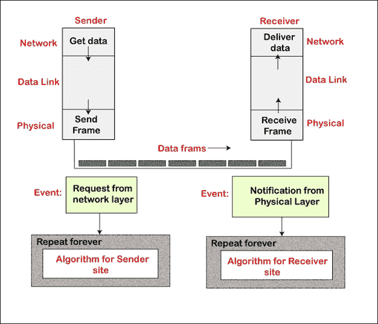
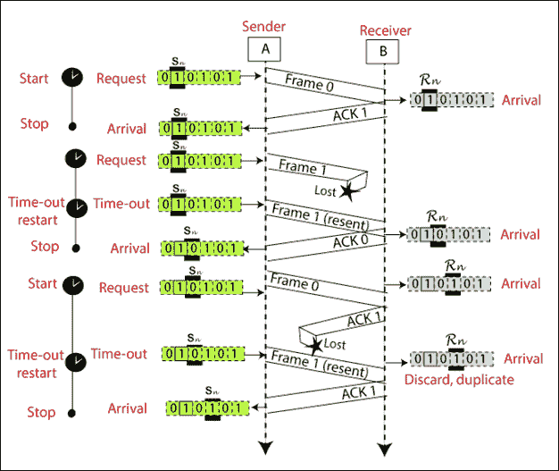
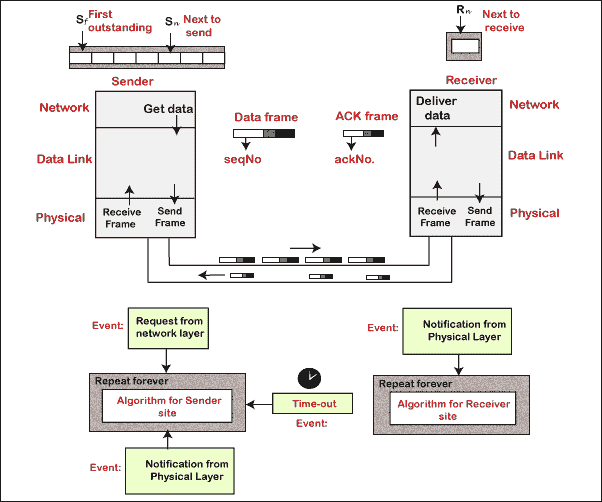

# 数据链路控制

> 原文：<https://www.tutorialandexample.com/data-link-control/>

**数据链路控制**

数据链路控制是数据链路层的主要功能。它处理两个相邻节点之间连接的配置和协调:节点到节点的通信。数据链路层的任务包括错误控制、软件实现的协议、流量控制以及在节点之间提供高效平滑的帧传输的成帧。

### 框架

数据链路层将从网络层获得的比特流分成称为帧的可用数据单元。


### 流控制

流量控制是数据链路层的基本职责之一。它管理在获得确认之前可以发送的数据量。流量控制是一组方法，告诉发送方在接收方过载之前可以传输多少数据。任何接收设备对于输入数据的处理和输入数据的存储都具有有限的速度和有限的存储器。


### 错误控制

错误控制包括错误检测和错误纠正两种方法。错误控制有助于接收方通知发送方在传输过程中丢失或损坏的帧。它允许发送方重新传输这些帧。在数据链路层，错误控制通常很容易实现:只要在帧中检测到错误，就会重新传输这些帧。

### 协议

这些协议通常使用一种通用编程语言来执行软件。协议分为两类:无噪声信道和有噪声信道。协议结构图如下所示。


### 无干扰波道

无噪声信道分为两个子类别:最简单协议和停止等待协议。这个通道的第一个协议不使用流量控制，而第二个协议使用流量控制。

### 最简单的协议

在这个协议中，它不使用流量和差错控制。它是一种单向协议，数据帧只在一个方向上从发送方传输到接收方。没有流量控制或错误控制的最简单协议的设计如下所示。



**算法**

最简单协议的发送方站点算法

```
while(true)           // Repeat forever
{
WaitForEvent();       // Sleep until an event occurs  
If (Event (RequestToSend))   // There is a packet to send
{   
 GetData();  
 MakeFrame();   
 SendFrame();       // Send the frame}}

```

最简单协议的接收端算法

```
while(true)             // Repeat forever
{
WaitForEvent();        // Sleep until an event occurs 
If (Event (ArrivalNotification))            // Data frame arrived
{          
ReceiveFrame();         
ExtractData();          
DeliverData();          // Deliver data to network layer}}
```

**比如**:最简单的协议很简单。发送方在不真正了解接收方的情况下发送序列中的帧。在这个发送三帧的协议中，发送端有三个事件，接收端有三个事件。下图显示了这些事件。


### 停止等待协议

发送方在停止等待协议中发送一个帧，直到接收方收到数据，然后发送下一个帧。在此协议中，添加了流量控制。该协议是数据帧的单向协议，但是辅助 ACK(确认)帧从其他方向传输。停止等待协议的设计如下所示。


**算法**

最简单协议的发送方站点算法

```
while (true)              // Repeat forever
canSend = true           // Allow the first frame to go 
{      
WaitForEvent ( );             // Sleep until an event occurs    
If (Event (RequestToSend) AND canSend)          
  {            
GetData ( );          
MakeFrame ( );          
SendFrame ( );                   // Sleep the data frame       
canSend = false;                // Cannot send until ACK arrives            
 }
WaitForEvent ( );               // Sleep until an event occurs  
    if (Event (ArrivalNotification))              // An ACK has arrived           
 {             
    ReceiveFrame ( );  
       // Receive the ACK frame           
      canSend = true;      
      }
}
```

最简单协议的接收端算法

```
while (true)                  // Repeat forever{                                
 WaitForEvent ( );         // Sleep until an event occurs     
 If (Event (ArrivalNotification))      // Data frame arrives  
   {   
ReceiveFrame ( );    
ExtractData ( );        
Deliver (data);         // Deliver data to network layer           
SendFrame ( );        // Send an ACK frame   
   }
}
```

**举个例子:**停止等待协议非常简单。发送方发送一个帧，然后等待接收方的响应。发送方在收到前一帧的 ACK 后发送下一帧。

请注意，在本例中发送三个帧涉及发送方的六个事件和接收方的三个事件。下图显示了这些事件。


### 嘈杂的频道

噪声信道分为三个子类别:

1.  停止等待自动重复请求
2.  自动重复请求
3.  选择性重复自动重复请求

### 停止等待自动重复请求

停止并等待自动重复请求是一种用于远程通信的协议，用于在两个相连的系统之间传输数据。

在停止等待自动重复请求协议中，发送方一次发送一帧。发送方发送帧并等待接收方的响应。发送方在收到前一帧的确认(ACK)信号后发送下一帧。当确认(ACK)在指定时间内没有到达发送方时，发送方再次发送相同的帧。

在每帧的末尾，发送方会添加冗余位。在接收端，这些冗余位用于检查帧的损坏。

在该协议中，我们需要帧的序列号。停止等待 ARQ 协议的设计如下所示。


**算法**

停止等待 ARQ 协议的发送方算法

```
Sn = 0;            //Frame 0 should be sent first    
canSend = true;     // Allow the first request to go 
while (true)         // Repeat forever
{    
 WaitForEvent ();       // Sleep until an event occurs     
  if (Event  (RequestToSend) AND canSend)      
 {             GetData (); 
    MakeFrame (Sn);                 // The seqNo is Sn           
  StoreFrame (Sn);              // Keep copy             
 SendFrame (Sn);           
  StartTimer ();            
 Sn = Sn + 1 ;           
 canSend = false ;      
 }    
 WaitForEvent ();                // Sleep        
 if (Event  (ArrivalNotification) )      // An ACK has arrived       
{             
ReceiveFrame (ackNo) ;         // Receive the ACK frame            
 if (not corrupted AND ackNo == Sn)    // valid ACK                   
{            
  Stoptimer ();          
 PurgeFrame ( Sn-1 ) ;            // copy is not needed                           
canSend = true ;                   
 }         
}        
if ( Event (TimerOut))            // The timer expired        
 {              
 StartTimer () ;              
 ResendFrame (Sn-1) ;         
 }
}                             
```

停止等待 ARQ 协议的接收端算法

```
Rn = 0 ;             // Frame 0 expected to arrive 
firstwhile ( true )
 {       
 WaitForEvent() ;       // Sleep until an event occurs       
 if ( Event (ArrivalNotification) )   // Data frame arrives        
   {         ReceiveFrame () ;    
  if (corrupted (frame) );      
      Sleep () ;          
 if ( seqNo == Rn )        // Valid data frame                  
  {           
  ExtractData () ;        
   DeliverData () ;            // Deliver data             
     Rn = Rn  +  1 ;                 
    }       SendFrame (Rn) ;     // Send an ACK           
  }
}          
```

下图显示了停止等待 ARQ 的示例。



### 回到 ARQ

Go-Back-N ARQ 协议也称为 Go-Back-N 自动重复请求。它是一种使用滑动窗口方法的数据链路层协议。在这种情况下，如果任何帧被破坏或丢失，所有后续帧都必须重新发送。

在这个协议中，发送方窗口的大小是 N。例如，发送方窗口的大小 Go-Back-8 将是 8。接收器窗口大小始终为 1。

如果接收器收到损坏的帧，它会将其取消。接收器不接受损坏的帧。当定时器到期时，发送方再次发送正确的帧。ARQ 协议的设计如下所示。



下图显示了 ARQ 折返的示例。


### 选择性重复 ARQ

选择性重复 ARQ 也称为选择性重复自动重复请求。它是一种使用滑动窗口方法的数据链路层协议。如果 ARQ 协议的错误较少，那么它工作得很好。但是如果帧中有很多错误，再次发送帧会损失很多带宽。因此，我们使用选择性重复 ARQ 协议。在这个协议中，发送方窗口的大小总是等于接收方窗口的大小。滑动窗口的大小总是大于 1。

如果接收器收到损坏的帧，它不会直接丢弃它。它向发送方发送一个否定的确认。一旦收到否定确认，发送方就会再次发送该帧。发送该帧无需等待任何超时。选择性重复 ARQ 协议的设计如下所示。


下图显示了选择性重复 ARQ 协议的示例。


### 背负式装运

它用于提高双向协议的性能。在捎带中，如果节点 A 向节点 B 发送数据，它也可以向节点 A 提供来自节点 B 的帧信息(或丢失的帧信息)。如果节点 B 向节点 A 发送数据，它也可以向节点 B 提供来自节点 A 的帧信息。