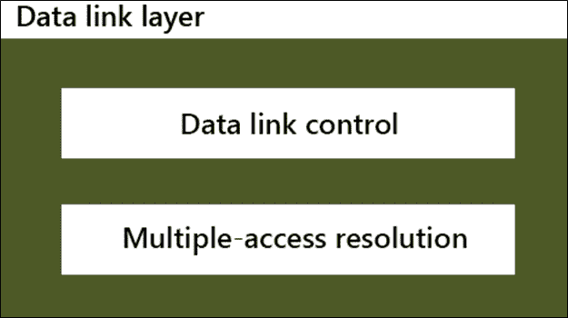
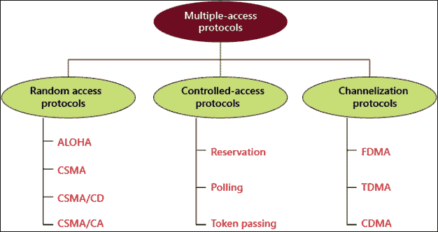
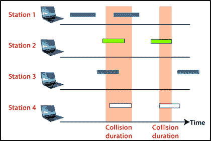
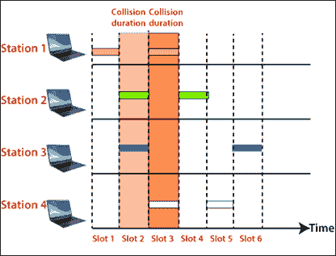
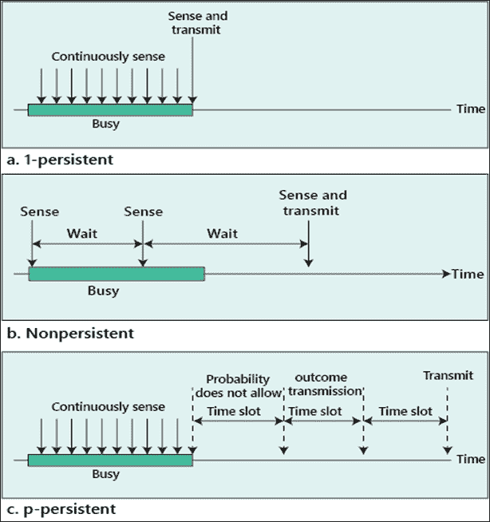
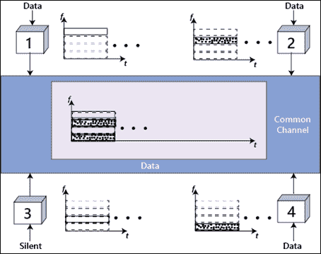
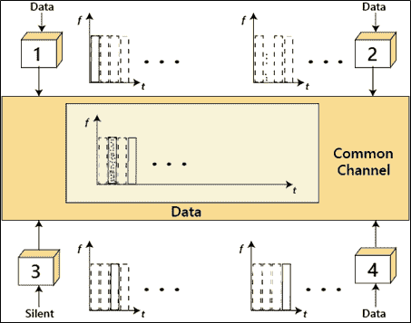

# 多路访问控制

> 原文：<https://www.tutorialandexample.com/multiple-access-control/>

**多路访问控制**:数据链路层分为两个子层。上层子层负责流量控制和错误控制，称为逻辑链路控制层。较低的子层负责称为媒体访问控制(MAC)的多路访问解决方案。数据链路层的子层如下图所示。

媒体访问控制协议分为三种协议:随机访问、受控访问和信道化协议。

### 随机接入协议

在随机接入协议中，所有系统都是平等的。没有任何一个系统可以依赖和控制另一个系统。但是，如果有多个工作站试图传输数据，就会产生访问冲突，即碰撞，从而导致帧丢失或更改。

随机接入协议分为两类；首先是 aloha，其次是 CSMA(载波侦听多路访问)。CSMA 后来进一步分为两种平行的方法；CSMA/CD 和 CSMA/CA。当检测到碰撞时，CSMA/CD 告诉工作站该做什么。CSMA/加州试图阻止冲突。

### 1.欢迎

ALOHA 是一种**多址协议**，用于网络中的随机接入。Aloha 是为无线局域网(WLAN)设计的，也称为无线电广播。在这种方法中，任何用户都可以在任何时候传输数据。

#### 阿罗哈的类型

1.纯阿罗哈

2.时隙 Aloha

**纯 aloha:** 纯 Aloha 也叫原 Aloha 协议。这是一个简单而优雅的协议，也就是说，只要系统有数据帧要发送，它就会连续传输数据帧。因此在这种 aloha 方法中碰撞的风险非常高。如下图所示，纯粹的阿罗哈。

*   最大吞吐量出现在 **G = 1/2** ，即 **18.4%** 。
*   在纯 Aloha 中，数据帧成功传输的概率为 **S= G* e^-2G**
*   在纯 Aloha 中，脆弱时间是: **2 * Tfr**

**时隙 aloha:** 时隙 Aloha 是为了提高纯 Aloha 的效率而开发的。在这种 Aloha 中，系统的时间被分成时隙，因此系统只能向一个时隙发送一帧，并且该帧只能在时隙的开始发送。如果系统无法在时隙开始时发送帧，则必须等待下一个时隙开始。如果两个系统试图在时隙开始时传输帧。但是比纯阿罗哈好，因为碰撞的机会少。显示在下面开槽阿罗哈。

*   在**时隙** **Aloha 中，**最大吞吐量出现在 **G = 1** ，即 **37%** 。
*   在**时隙** **Aloha，**数据帧成功传输的概率: **S=G* e^-G**
*   在**时隙** **阿罗哈，**脆弱时间是: **Tfr**

### 2.CSMA(载波侦听多路访问)

CSMA 的开发是为了提高性能和减少碰撞的机会。要求每个站在传输前测试介质的状态。换句话说，CSMA 是基于“先感觉后传输”的原则 CSMA 可以降低碰撞风险，但不能消除它。

**CSMA 主接入模式:**

**1-持久:**1-持久法非常简单快捷。在这种方法中，当站点发现线路空闲时，它立即发送它的帧。在这种方法中，冲突的几率非常高，因为一旦发现线路空闲，两个或更多的站就立即发送它们的帧。

**非持久:**在非持久方法中，如果发现线路为空，则立即传输帧。如果线条不清晰，它会随机等待一段时间，然后再次检测线条。这种方法降低了碰撞的风险。

**P-持久:**这种方法结合了 1-持久和非持久的优点。p-persistent 方法降低了冲突的风险并提高了性能。

在 P-Persistent 方法中，站点发现线路为空后，会执行以下步骤:

1.  该站以概率(p)发送其帧。
2.  以概率(q = 1？p)，该站等待下一个时隙的开始，并重新测试该线路。
3.  如果该行为空，则转到步骤 1。
4.  如果该行不为空，它的行为就像发生了冲突一样，并使用回退过程。

在后来，CSMA 被分成两个平行的方法:CSMA/CD 和 CSMA/CA。当检测到冲突时，CSMA/CD 告诉电台该做什么，CSMA/CA 试图阻止冲突。

#### CSMA/CD(带冲突检测的载波侦听多路访问)

CSMA/CD 是运行在多路访问控制层的运营商通信网络协议。

在这种方法中，站点在传输帧后跟踪介质，以查看传输是否成功。如果是，则该站工作完成。但是，如果有冲突，帧会重新发送。

#### CSMA/CA(带冲突避免的载波侦听多路访问)

CSMA/CA 用于无线网络，因为 CSMA 无法检测冲突，所以 CSMA/CA 是避免冲突的唯一解决方案。

在 CSMA/CA 中，使用三种技术来避免冲突:

1.  帧间间隔
2.  竞争窗口
3.  承认

*   **帧间间隔:**如果站点检测到空闲信道，站点不会立即发送帧。它等待一段时间。这个时间段称为 IFS 时间。IFS 通常用于描述电台的优先级。

*   **竞争窗口:**竞争窗口是被分成时隙的时间总和。当一个站准备发送一个帧时，它可以选择随机数量的时隙作为等待时间。根据二进制指数退避策略，窗口中的时隙数量改变。如下图所示。

*   **确认:**肯定确认或超时定时器有助于保证成功传输。

### 受控访问

在这种方法中，各站相互联系，看哪个信道适合传输。在其它站批准之前，一个站不能发送帧。有三种类型的受控访问:预留、轮询和令牌传递。

### 渠化

在这个过程中，网络的可用带宽在时间、距离或直通码上由几个站共享。有三种类型的信道化:FDMA(频分多址)、TDMA(时分多址)和 CDMA(码分多址)。

FDMA 的图如下所示。

TDMA 图如下所示。

