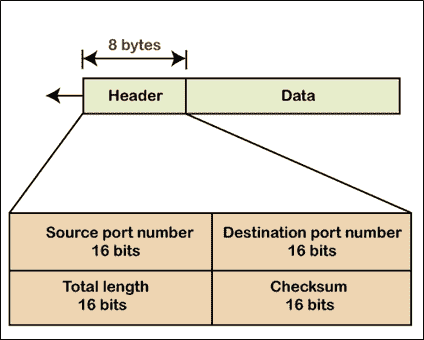

# 用户数据报协议

> 原文：<https://www.tutorialandexample.com/user-datagram-protocol/>

**用户数据报协议** : UDP 代表用户数据报协议。UDP 是由 David P Reed 在 1980 年开发的。这是一种无连接且不可靠的协议。在该协议中，当数据传输发生时，它不在发送方和接收方之间建立连接。它直接发送数据。在此协议中，接收方不发送任何接收数据的确认。在 UDP 中，数据包称为数据报。

UDP 不保证任何用户数据，不管它是否会到达目的地。在这个协议中，数据不必到达发送者发送数据的同一个序列器中的接收者。

### UDP 的重要性

*   UDP 协议用于在您需要比准确性和可靠性更高的速度时传输数据。
*   如果数据流方向相同，则使用 UDP。
*   它还用于流媒体应用，例如 YouTube 和在线游戏。
*   它提供比 TCP 协议更快的数据传输速度。

### 用户数据报协议格式

UDP 格式非常简单。UDP 的报头大小是 8 字节(8 字节意味着 64 位)。UDP 的格式如下图所示。

**它有如下所示的四个字段:**

*   **源端口号:**源端口的大小为 16 位。它用于识别发送方的流程。
*   **目的端口号:**目的端口的大小为 16 位。它用于识别接收者的进程。
*   **总长度:**总长度的大小为 16 位。它定义了 UDP 的总长度，还存储了数据和报头的长度。

**UDP 长度= IP 长度- IP 头的长度**

*   **校验和:**校验和端口的大小为 16 位。它用于检测整个用户数据报中的错误。

### **UDP 的优势**

1.  你可以很容易地通过 UDP 进行广播和组播传输。
2.  它比 TCP 更快。
3.  它使用小尺寸的报头(8 字节)。
4.  它比其他协议占用更少的内存。
5.  每当需要传输数据包时，就使用 UDP。

### **UDP 的缺点**

1.  这是一个不可靠的传输协议。
2.  它没有这样的功能来知道数据是否被接收到。
3.  UDP 中不使用握手方法。
4.  它不能控制拥塞。
5.  使用带 UDP 的路由器的主要缺点是，一旦传输失败，路由器就不再传输数据报。

### UDP 用于以下应用。

1.  域名系统。
2.  简单网络管理协议。
3.  路由信息协议。
4.  普通文件传输协议。

**UDP 和 TCP 服务**

| **服务** | **UDP** | **TCP** |
| 序列数据传送 | 不 | 是 |
| 多流 | 不 | 不 |
| 多重归巢 | 不 | 不 |
| 面向连接 | 不 | 是 |
| 无连接 | 是 | 不 |
| 允许半封闭连接 | 不适用的 | 是 |
| 应用 PDU 捆绑 | 不 | 是 |
| 拥塞控制 | 不 | 是 |
| 应用程序 PDU 碎片 | 不 | 是 |
| 保留邮件边界 | 是 | 不 |
| 部分可靠数据传输 | 不 | 不 |
| 选择性确认 | 不 | 可选择的 |

