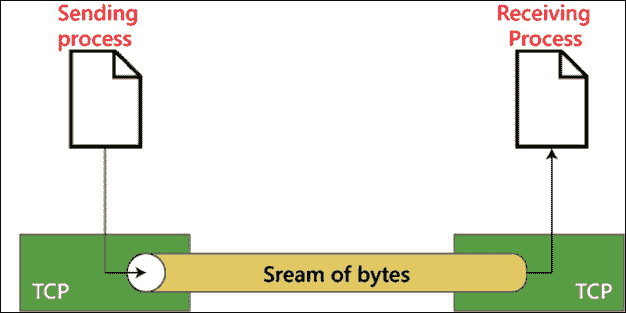
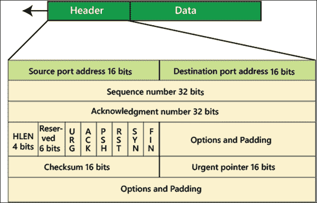
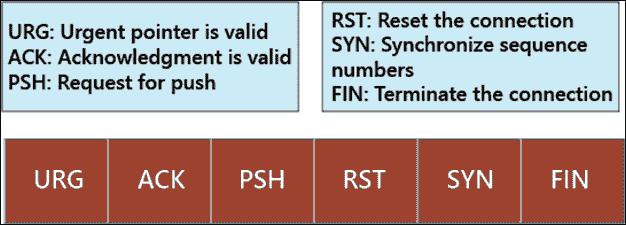
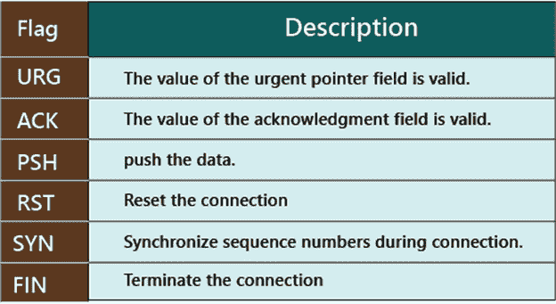

# 传输控制协议

> 原文：<https://www.tutorialandexample.com/transmission-control-protocol/>

**传输控制协议** : TCP 代表传输控制协议。它于 1974 年推出。它是面向连接的可靠协议。它在开始通信之前在源设备和目的设备之间建立连接。它检测目的设备是否已经接收到从源设备发送的数据。如果收到的数据格式不正确，它会再次发送数据。TCP 非常可靠，因为它使用握手和流量控制机制。在 TCP 协议中，接收方接收数据的顺序与发送方发送数据的顺序相同。我们在日常生活中使用 TCP 协议服务，如 HTTP、HTTPS、Telnet、FTP、SMTP 等。

### UDP 的重要性

*   TCP 协议用于传输数据，你需要的是准确性和可靠性，而不是速度。
*   TCP 和 UDP 都可以检查错误，但只有 TCP 可以修复错误，因为它可以控制流量和数据流。

### TCP 数据段格式

在 TCP 中，数据包被称为数据段。数据段中报头的大小是 20 到 60 字节。TCP 的数据段格式如下图所示。

*   **源端口地址:**源端口的大小为 16 位。它用于定义发送数据段的应用程序的端口地址。
*   **目的端口地址:**目的端口的大小为 16 位。目的端口用于定义接收数据段的应用程序的端口地址。
*   **序列号:**序列号的大小为 32 位。它定义了数据段中数据的唯一编号。
*   **确认号:**确认号的大小为 32 位。
*   **报头长度:**报头长度的大小为 4 位。它表示应用程序的标题。报头长度可以在 20 到 60 字节之间。因此，该字段的值为 5 (5 × 4 = 20)和 15 (15 × 4 = 60)。
*   **保留:**该字段的大小为 6 位。该字段供将来使用。
*   **控制标志:**该字段的大小为 6 位。它定义了六个不同的控制位或标志，如图所示。

*   **窗口大小:**窗口字段的大小为 16 位。它定义了发送方的发送窗口的大小。
*   **校验和:**校验和字段的大小为 16 位。校验和字段用于错误控制。它在 TCP 中是强制的。
*   **紧急指针:**紧急指针字段的大小为 16 位，仅在 URG 标志置位时需要。它用于段中的紧急数据。
*   **选项和填充:**选项和填充字段的大小从 0 到 40 字节不等。

### TCP 的优势

1.  **重传:**在 TCP 中，当一个数据失败时，该协议在特定时间后再次发送该数据。
2.  TCP 可以修复错误，因为它可以控制流量控制和拥塞控制。
3.  TCP 可以很容易地检测出错误。
4.  在 TCP 协议中，接收方接收数据的顺序与发送方发送数据的顺序相同。

### **TCP 的缺点**

1.  TCP 协议的数据传输速度低于 UDP 协议。
2.  TCP 协议不能广播和多播消息。