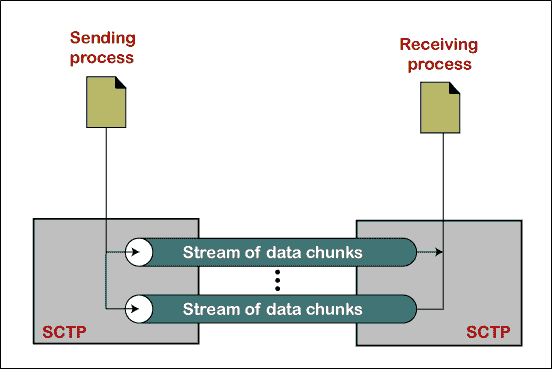
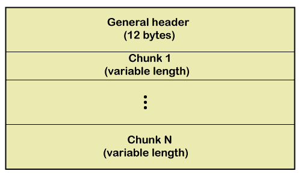
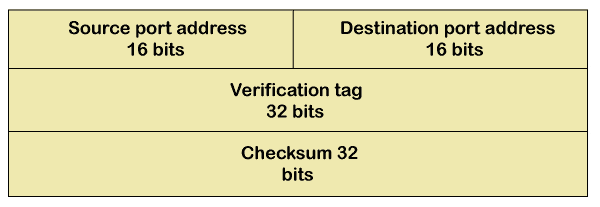
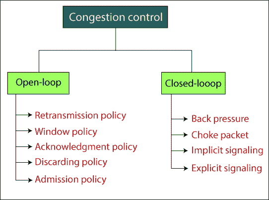

# 流控制传输协议

> 原文：<https://www.tutorialandexample.com/stream-control-transmission-protocol/>

**流控制传输协议** : SCTP 代表流控制传输协议。SCTP 是由互联网工程任务组(IETF)开发的。它是传输层的一个可靠的面向消息的协议。它提供了 TCP 和 UDP 的最佳功能。它是为特定的应用而设计的，例如多媒体。

### SCTP 服务

1.  它提供了类似 UDP 和 TCP 的进程间通信。
2.  它允许设备的每个连接中的**多流服务**被称为关联。在设备中，如果一个连接被阻塞，另一个连接仍然可以传送该数据。

*   它提供像 TCP 一样的全双工服务，数据可以同时双向流动。
*   它使用**确认(ACK)机制**来验证数据传输。

### SCTP 数据包格式

SCTP 数据包包含一个通用报头和一组称为块的数据块。SCTP 数据包中有两种类型的块:控制块和数据块。数据包的第一个块保持关联，数据包的第二个块携带用户数据。控制块先于数据块到达数据包。

**SCTP 的通用标题格式如下所示。**

**在通用标题中，有四个字段。**

*   **源端口地址:**源端口地址的大小为 16 位。它定义了发送数据包的进程的端口号。
*   **目的端口地址:**目的端口地址的大小为 16 位。它定义了接收数据包的进程的端口号。
*   **验证标签:**验证标签的大小为 32 位。该字段用于检查数据包是否来自正确的发送方。
*   **校验和:**校验和的大小为 32 位。

### SCTP、TCP 和 UDP 的比较

| **服务** | **UDP** | **TCP** | **SCTP** |
| 序列数据传送 | 不 | 是 | 是 |
| 多流 | 不 | 不 | 是 |
| 多重归巢 | 不 | 不 | 是 |
| 面向连接 | 不 | 是 | 是 |
| 无连接 | 是 | 不 | 不 |
| 允许半封闭连接 | 不适用的 | 是 | 不 |
| 应用 PDU 捆绑 | 不 | 是 | 是 |
| 拥塞控制 | 不 | 是 | 是 |
| 应用程序 PDU 碎片 | 不 | 是 | 是 |
| 保留邮件边界 | 是 | 不 | 是 |
| 部分可靠数据传输 | 不 | 不 | 可选择的 |
| 选择性确认 | 不 | 可选择的 | 是 |

### **拥堵**

**拥塞:**如果网络负载超过网络容量，这种情况称为拥塞。

**拥塞控制:**拥塞控制是指用于控制拥塞并将流量保持在网络容量以下的机制。拥塞控制分为两类:开环和闭环，如下图所示。

### **开环拥塞控制**

实施开环拥塞控制策略是为了在拥塞发生之前阻止它。拥塞控制由源或目的地控制。开环拥塞控制分为几类。

1.  **重传策略:**是数据包再次发送的策略。当发送方发现传输的数据包丢失时，发送方会再次发送该数据包。
2.  **窗口策略:**在窗口策略中，采用选择性重复窗口的方法来控制拥塞。
3.  **丢弃策略:**路由器可以丢弃不太敏感的数据包，以确保拥塞。

### **闭环拥塞控制**

闭环拥塞控制策略试图在拥塞发生后减少拥塞。闭环拥塞控制分为几类:背压、阻塞点、隐式信令和显式信令。