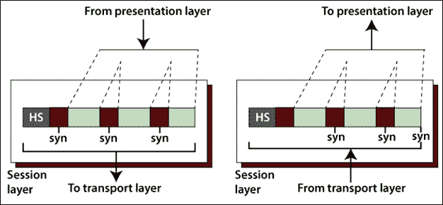
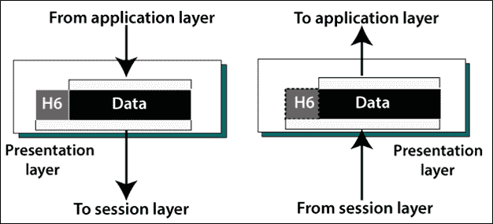

# 会话层和表示层

> 原文：<https://www.tutorialandexample.com/session-layer-and-presentation-layer/>

**会话层和表示层**

### 会话层

第五层是 OSI 模型中的会话层，它控制许多计算机之间的连接。它管理、建立和终止两个通信主机之间的会话连接。如下图所示。

### 会话层的主要功能

*   **对话控制:**在会话层，允许两个系统进入一个对话，该对话允许两个进程之间以半双工或全双工模式进行通信。
*   同步:它允许我们将检查点合并到数据流中。例如，假设系统正在发送 1000 比特的消息，它在每 50 比特之后插入检查点，以确保每个 50 比特单元被单独接收和确认。在这种情况下，如果在 453 位的传输过程中发生崩溃，只需要重传 401 到 453。不需要重新发送先前的 401 比特。
*   **令牌管理:** 会话层阻止两台主机同时尝试相同的操作。

**会话层的必要协议**

*   远程过程调用协议
*   点对点隧道协议(PPTP)
*   会话控制协议
*   会话描述协议(SDP)

### 表示层

第六层是 OSI 模型中的表示层。在表示层，它处理两个系统之间交换的语法和语义信息。如下图所示。

### 会话层的主要功能

*   **转换:**在传输之前，它将消息转换成兼容的比特流。因为不同的计算机使用不同的编码方法，所以它负责这些不同编码方法之间的互操作性，即将消息转换成标准格式。
*   **加密:**加密是指将原始信息转换成其他人无法阅读的另一种形式。
*   **压缩:**在压缩中，减少通过网络传输的位数。