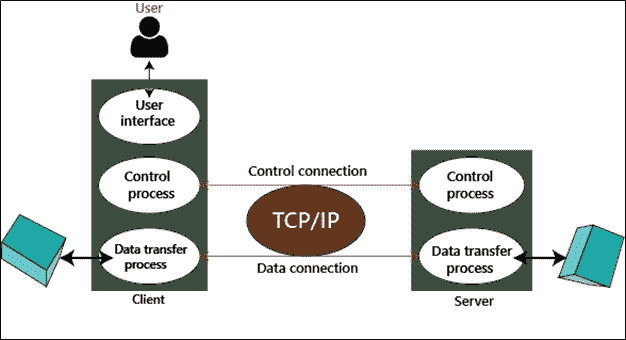
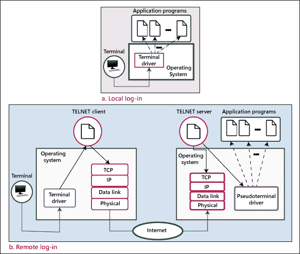
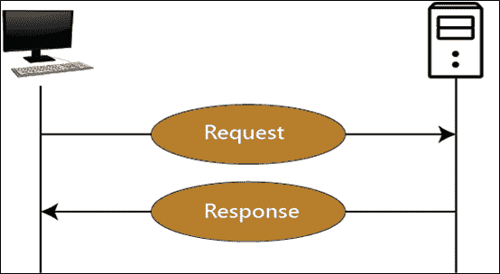
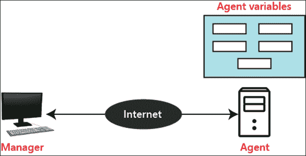
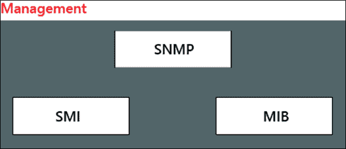

# FTP:文件传输协议

> 原文：<https://www.tutorialandexample.com/file-transfer-protocol>

**文件传输协议**

文件传输协议通常被称为 FTP。互联网最流行的服务是下载文件。换句话说，就是将文件从一台设备传输到互联网上的另一台设备。每天都有成千上万的文件通过 FTP 从一台设备传输到互联网上的另一台设备。该协议也用于在互联网上上传文件。FTP 在 TCP/IP 堆栈的顶部执行。

FTP 也是一种客户端-服务器协议。因此，它在客户机和服务器之间建立了两个 TCP 连接，其中第一个连接用于控制会话，第二个连接用于传输文件。

### ftp 服务器

使用 FTP 传输数据的计算机称为 FTP 服务器。任何用户都可以访问存储在 FTP 服务器中的数据，而某些数据可以由特殊用户访问。

FTP 分为两部分:

1.匿名服务器

2.非匿名服务器

## 用于远程联接服务的标准协议或者实现此协议的软件(可为动词)

Telnet 代表终端网络。Telnet 是一种基于文本的应用层协议，用于通过 TCP/IP 网络访问远程设备。Telnet 是由互联网工程任务组于 1969 年开发的。Telnet 提供基于命令行界面的服务。

### 远程登录概念

Telnet 是最古老的互联网设施。它允许你在任何电脑上使用远程电脑。它也称为远程登录方法。通常，telnet 程序为另一台计算机提供一个基于文本的窗口。如果您有权限访问该系统，您可以像在您的计算机上一样对其进行操作。对于那些想在其他计算机上做这些工作的人来说，这个工具非常有用，因为这些工作不能通过 FTP 和 HTTP 等其他工具来完成。

### 超文本传输协议

HTTP 是一种应用层协议。它用于通过网站传输数据。HTTP 是互联网协议套件的一个组成部分。它定义了用于将数据发送到网页的命令和实用程序。

### HTTP 的功能

HTTP 有三个基本特性:

1.  无连接传输模式
2.  媒体独立
3.  无国籍的

**无连接:**HTTP 客户端向 HTTP 服务器发起请求，请求发出后，客户端等待响应。服务器响应客户端的请求，并向客户端发送响应。之后，客户端断开连接。

**媒体无关:**任何类型的数据都可以通过 HTTP 发送。

**无状态:** HTTP 是无连接的，同样，它也是一种无状态协议，因为客户端和服务器只在当前请求期间知道彼此。

### HTTPS(超文本传输协议安全)

HTTPS 是一种应用层协议，通过它可以从互联网上的任何网站进行安全通信。这是一种协议，它通过由传输层安全性加密的连接使用 HTTP。它主要用于保护网上购物和银行网站的安全。

HTTPS 使用端口 443 传输数据。

### 简单网络管理协议

SNMP 是由 IETF(互联网工程任务组)开发的。它用于管理网络。它是一种互联网标准协议，用于监控 IP 网络中的设备，并收集和组织这些设备的信息。大多数网络设备都支持 SNMP，如集线器、交换机、路由器、网桥、服务器、调制解调器和打印机等。

SNMP 的概念是基于管理器和代理的。管理器就像控制一组代理(如路由器)的主机。

**SNMP 管理器:**它是一个通过 SNMP 代理监控网络流量的计算机系统，它查询这些代理，获取答案，并控制它们。

**SNMP 代理:**它是位于网元中的软件程序。它从设备收集实时信息，并将这些信息传递给 SNMP 管理器。

**管理组件**

它有两个组成部分

1.  标准测量仪器(Standard Measuring Instruments)
2.  管理信息库

SNMP 管理:它定义了管理器和代理之间共享的数据包的结构。

**SMI** **(管理信息的结构):** SMI 是一个网络管理组件，它定义了命名对象和对象类型(包括范围和长度)的标准规则，并显示了如何对对象和值进行编码。

MIB(管理信息库) : MIB 是网络管理的第二个组成部分。它是存储管理信息的虚拟信息存储。