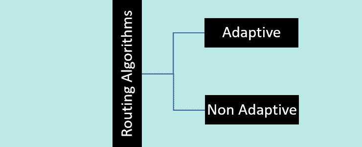

# 路由算法的分类

> 原文：<https://www.tutorialandexample.com/classification-of-routing-algorithms>

## 介绍

在进行路由算法的分类之前，我们必须弄清楚什么是路由。因此，路由可以定义为建立数据包到达目的地所必须经过的路径的过程，也就是路由的过程。在此过程中将建立一个路由表，并提供数据包所采用路径的详细信息。为了决定传入数据分组的最佳行进路线，以便有效地到达其目的地，使用了几种不同的路由算法。

网络层的主要职责是提供最佳路由，无论是通过数据报服务还是虚拟电路服务。这个过程将由路由协议来维护。从源到期望端点的最便宜的路径将是最佳路径。

## 路由算法的分类

路由算法主要分为两类

### 路由算法有

1.  自适应路由算法
2.  非自适应路由算法

让我们进一步简要讨论每种路由算法及其类型。

## 自适应路由算法

*   这些算法通常被称为“动态路由算法”，因为将根据网络和拓扑做出动态决策。
*   当网络拓扑或流量负载发生变化时，这些算法会相应地调整其路由决策。随着路由决策的变化，网络的结构和流量都会发生变化。
*   这些算法将根据当前拓扑、负载和延迟等动态信息来选择路由。距离、跳数和估计的传输时间被用作优化参数。

又创建了三个类别来进一步分离这些自适应算法。他们是

1.  偏远的；孤立的
2.  分布的
3.  集中的

### 孤立算法

在这种孤立的算法中，系统中的每个节点根据手头的信息决定如何路由流量，而不是从其他节点请求输入。特定连接的状态对于相应的发送节点来说是未知的。这种算法的缺点是，在堵塞的网络上发送数据包可能会导致延迟。烫手山芋路由和逆向学习就是基于该算法的两个例子。

### 分布式算法

分布式算法也是自适应算法之一。在这种策略中，节点将在决定如何路由数据包之前收集来自其邻居的数据。如果它获取信息和发送数据包的时间间隔发生变化，数据包可能会被延迟，这被认为是一个缺点。因为它确定了源和目的地之间的最小成本路由，所以这种分布式算法有时被称为分散式算法。

一个节点最初只知道它自己的直接连接的链接，并且通过迭代计算过程，它确定到目的地的最低成本路由。距离矢量算法是一种分散式算法，它只知道数据包传输的方向和最经济的方式，永远不知道从源到目的地的整个过程。

### 集中化算法

它也被称为“全局路由算法”，因为它使用全面的全球网络知识来确定源和目的地之间的最低成本路由。在进行任何计算之前，通过这种方法检索节点之间的连接和链路成本作为输入。

## 非自适应算法

静态路由算法是非自适应路由算法的别名。非自适应路由算法不依赖于网络流量或拓扑来选择路由。这意味着这些算法一旦选择了路线，就不会改变。网络启动时，路由器会存储路由信息。

此外，这种非自适应算法被归类为其他两种算法

1.  洪水泛滥
2.  随机游动

### 洪水泛滥

在泛洪期间，除了已经到达的链路之外，每个传入的分组都被发送到每个传出链路。泛洪的缺点是每个节点可能有同一数据包的多个副本。泛洪算法比路由更可靠，并且具有高流量。这种算法的唯一问题是存在重复的数据包。

### 随机游动

在随机行走过程中，来自一个节点的数据包被随机传输到它的一个邻居。将数据包发送到具有最少挂起连接的链路上是应用这种非常可靠的策略的典型方式。随机漫步的好处是可以很好地利用其他路线。