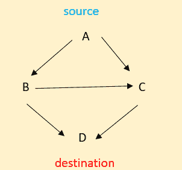

# 固定和泛洪路由算法

> 原文：<https://www.tutorialandexample.com/fixed-and-flooding-routing-algorithms>

## 介绍

在研究固定路由和泛洪路由算法之前，我们必须回顾一下路由这个话题。路由可以定义为

## 路由:是什么？

路由算法计算出到达某个地方的最佳路线。大多数情况下，数据包必须经过许多跳才能到达目的地。分组交换网络体系结构中最棘手也是最重要的元素之一是路由。

## 路由算法属性

路由算法具有以下特点:可靠、稳定、易于使用、最优和高效。它们也应该简单、公平。该路由算法才被认为是一个体面的路由算法。

## 路由技术

路由算法中有不同类型的路由技术。路由技术列表如下:

1.  洪水泛滥
2.  固定路由
3.  基于流的路由
4.  随机路径选择
5.  动态路由

让我们在本教程中讨论前两种路由算法。这些是固定和泛洪路由算法。

## 洪水泛滥

不需要任何网络知识的路由算法称为泛洪算法。每个邻居都会收到一个节点发送的数据包。除了传入链路之外的所有链路都将重新传输传入的数据包。在这种路由算法中，许多副本到达它们的目的地。

每个包都有一个独特的号码，允许重复的包被扔掉。数据包可能包含跳数。为了控制网络负载，节点可以记住已经转发的数据包。它走了所有可能存在的路线。

**例子**

我们知道，每一个传入的数据包——除了它到达的那一个——都是通过每一个其他的输出线路发出的。洪水就是这个的术语。

从上面的例子中，我们可以观察到 A 是源，D 是目的。每个节点在所有可能的路径上发送数据包。但主要的缺点是相同数据的重复增加，这意味着重复的数据包增加。

来停止和消除这种重复的数据包。我们有三种方法来防止这个问题。他们是

1.  使用跳计数器
    只需在每个路由器中减少来自源的数据包，如果计数器达到 0，则删除数据包。
2.  包的顺序编号
    每个包都必须有一个特殊的编号。它将避免再次传送相同的数据分组。还要维护每个源的每个路由器中已经观察到的数据包的记录。
3.  选择性泛洪
    只使用看起来朝向正确方向的线。

## 洪水的特征

*   一旦探索了所有选项，至少会有一条最快的路径。
*   直接或间接链接的每个节点都可以访问。
*   我们尝试了源和目的地之间的每一条路径。如果有路由，数据包总是会通过。

## 淹没的限制

这种路由算法有一些限制，其中出现了一些缺点。局限性是

*   在泛洪过程中，会产生大量重复的数据包。
*   我们应该使用适当的减震装置。

## 洪水的好处

洪水的主要优点是

*   洪泛算法是高度鲁棒的，并且通信可以立即传输或者在紧急情况下传输。并且该算法将向广播中的所有节点发送消息。
*   该算法将为该路由创建虚电路。洪水过程总是走最快的路线。

## 固定路由

一种称为固定路由算法的技术建立了用于将数据分组从它们的源传送到它们的目的地的定义的路径或路由。根据数学计算，该路由是数据包可以采用的“最低成本路径”或最佳路径。路由保存在路由表中，只有当网络拓扑发生变化时，路由表才会改变。

*   这种固定路由算法的好处在于它是一种简单的路由算法。它将在具有稳定负载的稳定网络上有效运行。对于数据报和虚电路，这是一种类似的路由算法。
*   这种固定路由算法的主要缺点是不灵活，并且不能对故障或网络拥塞做出响应。

如果路由器发生故障，数据包就无法到达目的地。因此，数据包不会重复。它不会导致不必要的流量。没有带宽浪费。

## 结论

最后，我们得出结论，数据包可以使用泛洪和固定路由技术通过由传输线连接的中间路由器网络发送。